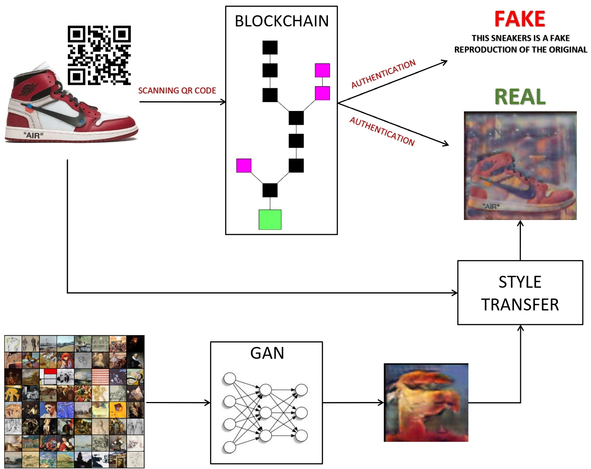

# Blockchain Sneakers Authentication
The sneakers market is one of the most important trends nowadays. Besides the usual market, the reselling one is born: companies such as Nike or Adidas put on the market a limited number of sneakers per model, and people try to buy them not only for themselves but often to resell them to a higher price. This new market has brought about counterfeiting problems. To overcome this problem we propose an authentication system based on blockchain. Each sneaker is associated with a QR Code which is linked to the immutable information contained in the blockchain. In addition to that we create an associated NFT to add uniqueness to the product. This NFT is generated with a style transfer that tries to combine the sneakers' image and an artwork generated by a Generative Adversarial Network.




### Usage

Let's explain how to use the system:

* ```BlockchainCode```: Contains the code used to implement the blockchain to authenticate. Just run blockchain.py to start working with it. 
* ```SmartContract```: Contains the scripts used to create, deploy, mine the NFT Smart Contract.
* ```TryQRCode```: Running the read.py code you can check if the QRCode is Authentic or not by checking the blockchain data. The folder contains an example of authentic QRCode and one of fake. 
* ```BlockChainSneakersAuthentication.pdf```: Paper to explain the whole system.
* ```GAN_NFT.ipynb```: Notebook to train the GAN and to create the NFT image (with Style Transfer).
* ```blockchain_sneakers_authentication.pptx```: Presentation of the work. 


